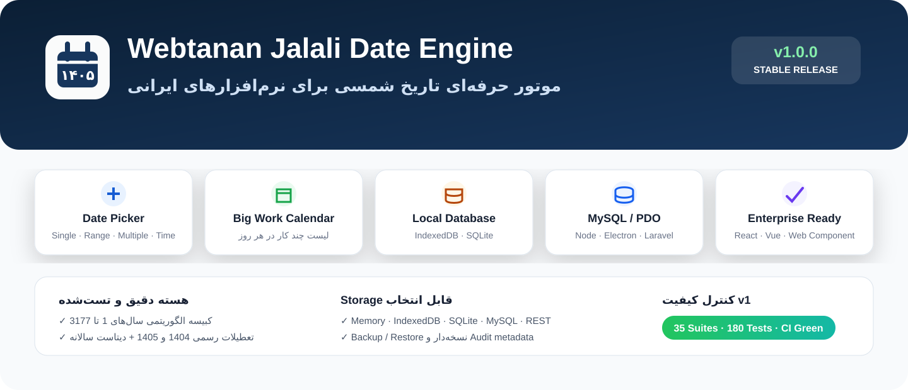
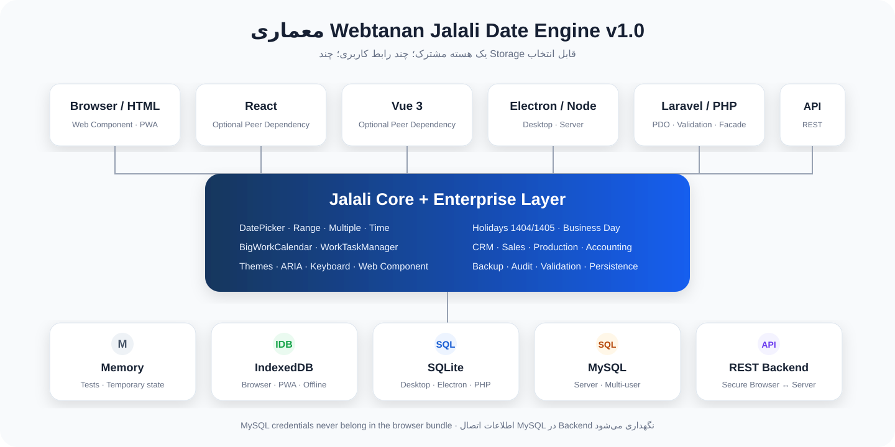

# Webtanan Jalali Date Engine

<p align="center">
  
</p>

## موتور تاریخ شمسی برای نرم‌افزارهایی که قرار است واقعاً استفاده شوند

ما در **تیم وب‌تنان** این پروژه را از یک نیاز ساده شروع کردیم: در نرم‌افزارهای فارسی، تاریخ شمسی معمولاً فقط به یک Date Picker محدود می‌شود؛ اما وقتی پروژه وارد CRM، فروش، حسابداری، تولید، پیگیری مشتری، برنامه‌ریزی یا کار روزانه می‌شود، خیلی زود به چیزهای بیشتری نیاز داریم.

سال کبیسه باید درست محاسبه شود. تعطیلات باید قابل به‌روزرسانی باشند. تاریخ شمسی و میلادی باید کنار هم نگهداری شوند. کارهای هر روز باید در یک تقویم بزرگ دیده شوند. اطلاعات باید بتوانند روی Browser، SQLite یا MySQL ذخیره شوند. و همه این‌ها نباید هر بار از صفر در یک پروژه جدید دوباره نوشته شوند.

**Webtanan Jalali Date Engine** نتیجه همین مسیر است: یک هسته جلالی چندسکویی برای JavaScript، TypeScript، React، Vue، Electron، PHP و Laravel؛ همراه با Date Picker، تقویم کاری بزرگ، تعطیلات، روز کاری، Task، Workflow، Theme و Persistence.

> **نسخه پایدار فعلی: v1.0.0**  
> هسته v1 پیش از انتشار Stable در Release Candidate با **۳۵ Test Suite و ۱۸۰ تست موفق**، Typecheck، Buildهای ESM/CommonJS/Browser، Package Smoke، PHP و SQLite بررسی شده است.

---

## چیزی که برای ما در v1 مهم بود

هدف ما فقط این نبود که «یک تقویم شمسی نمایش داده شود». چند اصل را از ابتدا برای نسخه پایدار جدی گرفتیم:

- محاسبه کبیسه باید **الگوریتمی** باشد، نه بر اساس یک لیست دستی از چند سال اخیر.
- انتخاب سال قدیمی مثل **۱۳۶۰** باید همان‌قدر قابل اعتماد باشد که انتخاب سال ۱۴۰۵.
- دیتاست تعطیلات باید از هسته جدا باشد تا هر سال بتوان آن را بدون تغییر الگوریتم تقویم به‌روزرسانی کرد.
- تقویم باید هم برای انتخاب یک تاریخ کوچک مناسب باشد و هم برای یک صفحه مدیریتی بزرگ با چند کار در هر روز.
- Storage نباید به یک محیط خاص قفل شود.
- اتصال مستقیم Browser به MySQL نباید تشویق شود؛ اطلاعات حساس باید در Backend بمانند.
- React و Vue باید اختیاری باشند و هسته اصلی را سنگین نکنند.
- API عمومی قبل از v1 باید تست شود تا تغییرهای بعدی ناخواسته پروژه‌های مصرف‌کننده را نشکنند.

---

# قابلیت‌های اصلی

## هسته جلالی

- تبدیل دقیق شمسی ↔ میلادی
- خروجی Gregorian ISO
- اعتبارسنجی تاریخ شمسی و میلادی
- پشتیبانی از اعداد فارسی، عربی و لاتین
- محاسبه سال کبیسه از خود الگوریتم
- محدوده پشتیبانی فعلی: **سال شمسی ۱ تا ۳۱۷۷**
- محاسبه تعداد روز ماه، اسفند و کل سال
- دریافت اطلاعات کامل سال با `JalaliYearEngine`

```ts
JalaliConverter.isLeapYear(1360); // false
JalaliConverter.isLeapYear(1358); // true
JalaliConverter.daysInMonth(1360, 12); // 29
getJalaliYearInfo(1360);
```

یعنی وضعیت کبیسه سال ۱۳۶۰ یا هر سال دیگر در محدوده پشتیبانی‌شده از **الگوریتم تقویم** به دست می‌آید و وابسته به دیتاست تعطیلات نیست.

---

## Date Picker

`WebtananDatePicker` برای فرم‌ها و ورودی‌های معمول نرم‌افزار طراحی شده است.

- Single Date
- Range
- Multiple Date
- Date + Time
- ساعت، دقیقه و ثانیه
- Minute Step مثل ۱۵ دقیقه
- Min / Max Date
- Disabled Dates
- روزهای بسته سازمانی
- Keyboard Navigation
- ARIA Accessibility
- اعداد فارسی
- RTL کامل
- Web Component مستقل

```ts
const picker = new WebtananDatePicker({
  rtl: true,
  persianDigits: true,
  time: true,
  minuteStep: 15,
  theme: 'navy-command',
});

picker.setDate('1405/06/11');
picker.setTime(14, 30);
picker.open('#calendar');
```

---

# Big Work Calendar — تقویم بزرگ کاری

یکی از بخش‌هایی که در مسیر توسعه برای ما مهم شد، داشتن یک تقویم **تمام‌صفحه و مدیریتی** بود؛ جایی که هر روز فقط یک عدد نباشد و بتوان داخل همان روز چند کار واقعی دید.

`BigWorkCalendar` برای همین سناریو ساخته شده است.

هر Task می‌تواند شامل این اطلاعات باشد:

- عنوان کار
- تاریخ شمسی و معادل میلادی
- ساعت شروع و پایان
- وضعیت: `todo` / `in_progress` / `done` / `cancelled`
- اولویت: `low` / `normal` / `high` / `urgent`
- مسئول
- دسته‌بندی
- توضیح
- رنگ و Tag
- `createdBy`
- `createdAt` / `updatedAt`
- زمان تکمیل

در روزهای شلوغ، چند کار اول داخل خانه روز نمایش داده می‌شوند و ادامه با «+N کار دیگر» در دسترس است.

```ts
const manager = new WorkTaskManager();

manager.add({
  date: '1405/06/11',
  title: 'جلسه برنامه تولید',
  time: '09:30',
  assignee: 'مدیر تولید',
  priority: 'high',
  category: 'تولید',
});

const calendar = new BigWorkCalendar(manager, {
  year: 1405,
  month: 6,
  theme: 'navy-command',
});

calendar.open(document.querySelector('#work-calendar'));
```

Demo آماده:

```text
demo/work-calendar.html
```

---

# Theme System

ظاهر پروژه را طوری طراحی کردیم که برای نرم‌افزارهای مدیریتی، فروش، تولید و استفاده طولانی‌مدت مناسب باشد؛ نه صرفاً یک تقویم فانتزی.

چهار Theme داخلی:

- **Industrial Light — صنعتی روشن**
- **Navy Command — فرماندهی سرمه‌ای**
- **Steel Neutral — فولادی خنثی**
- **Graphite Dark — گرافیتی تیره**

Theme سفارشی نیز با CSS Variables قابل تعریف است.

```ts
ThemeManager.apply(element, 'graphite-dark');
```

---

# تعطیلات ایران

در v1 دیتاست داخلی این سال‌ها وجود دارد:

- **۱۴۰۴**
- **۱۴۰۵**

هر Dataset دارای metadata منبع و تاریخ بازبینی است.

سیاست ما این است که دیتاست تعطیلات **سال‌به‌سال به‌روزرسانی شود** و الگوریتم تبدیل تاریخ یا سال کبیسه به آن وابسته نباشد. برای سال‌های بعد `HolidayDatasetLoader` در نظر گرفته شده تا Dataset جدید بدون تغییر هسته وارد سیستم شود.

تعطیلات شرکت و تعطیلی‌های اختصاصی نیز جداگانه قابل ثبت هستند.

---

# روز کاری و وضعیت روزها

وضعیت‌های قابل استفاده:

- `free` — آزاد
- `work` — دارای کار
- `meeting` — جلسه
- `holiday` — تعطیل
- `closed` — بسته

`BusinessDayCalculator` می‌تواند:

- روز کاری بعدی و قبلی را پیدا کند
- N روز کاری اضافه یا کم کند
- تعداد روزهای کاری یک بازه را حساب کند
- جمعه، تعطیلات رسمی/شرکتی و روزهای بسته را لحاظ کند

---

# CRM، فروش، تولید و حسابداری

هسته v1 چند Adapter سازمانی هم دارد تا تاریخ در پروژه فقط یک ورودی جداافتاده نباشد.

### CRM

- Follow-up مشتری
- Timeline
- پیگیری آینده
- Audit record

### فروش

```text
ثبت سفارش → تأیید → تولید → بارگیری → تحویل
```

- وضعیت مرحله
- مسئول
- تاریخ شمسی و میلادی
- درصد پیشرفت
- مرحله جاری
- تشخیص تأخیر

### تولید

- برنامه‌ریزی
- تأمین مواد
- تولید
- کنترل کیفیت
- بسته‌بندی
- بارگیری
- تحویل

### حسابداری

`AccountingCalendarAdapter` برای:

- فاکتور
- سررسید پرداخت
- دریافت
- حقوق
- مالیات
- بستن دوره

---

# Storage و دیتابیس

یکی از تصمیم‌های اصلی v1 این بود که UI به نوع دیتابیس وابسته نباشد.

<p align="center">
  
</p>

## Browser / PWA

- `IndexedDbWorkTaskRepository`
- `BrowserStorageAdapter`
- LocalStorage فقط برای Stateهای سبک

## Electron / Node

- SQLite از طریق `SqlWorkTaskRepository` و Driver تزریقی
- MySQL از طریق همان Repository و `Mysql2Executor`

## PHP / Laravel

- PDO
- SQLite
- MySQL
- Laravel Cache Store
- `PdoWorkTaskRepository`

## Backend / API

- `RestStorageAdapter`

> **نکته امنیتی:** اطلاعات اتصال و رمز MySQL نباید داخل JavaScript سمت Browser قرار بگیرد. در برنامه وب، MySQL باید پشت Backend / Laravel / Node Server یا API امن قرار داشته باشد.

راهنمای کامل:

```text
docs/DATABASE_FA.md
```

---

# Backup و Restore

Taskهای تقویم کاری می‌توانند به Backup نسخه‌دار JSON تبدیل شوند.

```ts
const backup = WorkTaskBackup.create(manager.toJSON());
const json = WorkTaskBackup.stringify(backup);

const restored = WorkTaskBackup.parse(json);
await WorkTaskBackup.restore(repository, restored, 'replace');
```

حالت‌های Restore:

- `replace`
- `merge`

---

# نصب

## JavaScript / TypeScript از GitHub

تا زمانی که نسخه Registry به‌صورت رسمی منتشر نشده، نصب مستقیم از GitHub مسیر قابل اتکاست:

```bash
npm install github:webtanan-sketch/webtanan-jalali-date-engine
```

بعد از انتشار رسمی در npm:

```bash
npm install webtanan-jalali-date-engine
```

ما عمداً تا قبل از انتشار واقعی Registry، نصب npm Registry را در مستندات به‌عنوان «منتشرشده» اعلام نمی‌کنیم.

## PHP / Laravel از GitHub

```bash
composer config repositories.webtanan-jalali vcs https://github.com/webtanan-sketch/webtanan-jalali-date-engine.git
composer require webtanan/jalali-date-engine:dev-main
```

نصب مستقیم زیر فقط پس از انتشار واقعی Packagist قابل اتکا خواهد بود:

```bash
composer require webtanan/jalali-date-engine
```

---

# React

```tsx
import { WebtananJalaliDatePickerReact } from 'webtanan-jalali-date-engine/react';
import 'webtanan-jalali-date-engine/css';

<WebtananJalaliDatePickerReact
  value="1405/06/11"
  options={{ theme: 'industrial-light', time: true }}
  onChange={(value) => console.log(value)}
/>
```

React یک Peer Dependency اختیاری است.

---

# Vue 3

```vue
<script setup lang="ts">
import { ref } from 'vue';
import { WebtananJalaliDatePickerVue } from 'webtanan-jalali-date-engine/vue';
import 'webtanan-jalali-date-engine/css';

const value = ref('1405/06/11');
</script>

<template>
  <WebtananJalaliDatePickerVue v-model="value" />
</template>
```

Vue نیز Peer Dependency اختیاری است.

---

# Browser / HTML

```bash
npm install
npm run build
```

خروجی‌های Browser:

```text
dist/browser/webtanan-jalali.js
dist/browser/webtanan-jalali.min.js
dist/browser/webtanan-jalali.css
```

Global:

```js
window.WebtananJalali
```

Web Component:

```html
<webtanan-jalali-date-picker
  value="1405/06/11"
  theme="graphite-dark"
></webtanan-jalali-date-picker>
```

---

# Laravel / PHP

بخش PHP شامل این اجزاست:

- `JalaliDate`
- `JalaliYearInfo`
- `JalaliValidator`
- Laravel Validation Rule
- Facade
- Service Provider
- Blade View
- Laravel Cache Store
- PDO State Store
- PDO Work Task Repository
- SQLite / MySQL Connection Factory

```php
use Webtanan\JalaliDateEngine\JalaliDate;

JalaliDate::toGregorianIso(1405, 6, 11);
// 2026-09-02

JalaliDate::isLeapYear(1360);
// false
```

---

# Demoها

بعد از `npm run build` این فایل‌ها را با یک HTTP Server محلی باز کنید:

```text
demo/index.html          Theme / Leap Year / Holidays Lab
demo/work-calendar.html  Big Work Calendar
demo/crm.html            CRM Follow-up
demo/sales.html          Sales Workflow
demo/accounting.html     Accounting + Business Day
demo/production.html     Production Workflow
```

---

# تست و کنترل کیفیت

```bash
npm run test:ci
```

این دستور شامل:

1. TypeScript Typecheck
2. Jest Test Suite
3. TypeScript Declarations Build
4. ESM Build
5. CommonJS Build
6. Browser Bundle
7. Minified Bundle
8. Package Smoke Test

PHP:

```bash
php php/tests/run.php
```

در Release Candidate نهایی v1 نتیجه این بود:

```text
Test Suites: 35 passed, 35 total
Tests:       180 passed, 180 total
Package Smoke: passed
PHP: passed
SQLite Task Repository: passed
Stress Test: 5000 tasks
```

CI روی Pushهای `main` اجرا می‌شود.

---

# مستندات

- `docs/API_FA.md` — API کامل فارسی
- `docs/DATABASE_FA.md` — SQLite / IndexedDB / MySQL / Repository
- `docs/INSTALLATION_FA.md` — نصب
- `docs/LARAVEL_FA.md` — Laravel
- `docs/FRAMEWORKS_FA.md` — React / Vue / Electron
- `docs/HOLIDAYS_FA.md` — سیاست دیتاست تعطیلات
- `docs/THEMES_FA.md` — Theme System
- `docs/VERSIONS_FA.md` — تاریخچه نسخه‌ها
- `docs/RELEASE_CHECKLIST_FA.md` — چک‌لیست انتشار v1

---

# ساختار پروژه

```text
src/
├── accessibility/
├── calendar/
├── core/
├── enterprise/
├── framework/
├── integrations/
├── storage/
├── theme/
├── time/
├── ui/
├── web-component/
└── work/

php/
tests/
demo/
docs/
scripts/
```

---

# درباره نگهداری پروژه

نسخه 1.0 برای ما پایان کار نیست؛ نقطه‌ای است که از آن به بعد می‌توانیم تغییرات را با قرارداد روشن‌تری مدیریت کنیم.

در نسخه‌های بعدی:

- API عمومی بر اساس SemVer نگهداری می‌شود.
- تغییر Breaking بدون افزایش Major Version انجام نمی‌شود.
- دیتاست تعطیلات ایران به‌صورت سالانه به‌روزرسانی می‌شود.
- Bug Fixها و بهبودهای Performance با تست همراه خواهند بود.
- قابلیت‌های جدید تا جای ممکن به‌صورت ماژولار اضافه می‌شوند تا هسته سبک بماند.

اگر از پروژه در یک نرم‌افزار واقعی استفاده کردید و به موردی برخوردید که در تست‌های ما دیده نشده، Issue دقیق با نمونه ورودی/خروجی برای ما ارزشمندترین نوع بازخورد است.

---

## مجوز

MIT

---

### از طرف تیم وب‌تنان

ما این پروژه را برای همان نوع نرم‌افزارهایی ساختیم که خودمان دوست داریم با آن‌ها کار کنیم: ساده در استفاده، دقیق در جزئیات و قابل نگهداری در پروژه‌های واقعی.

**Webtanan — ابزارهای حرفه‌ای برای نرم‌افزارهای فارسی و سازمانی**
